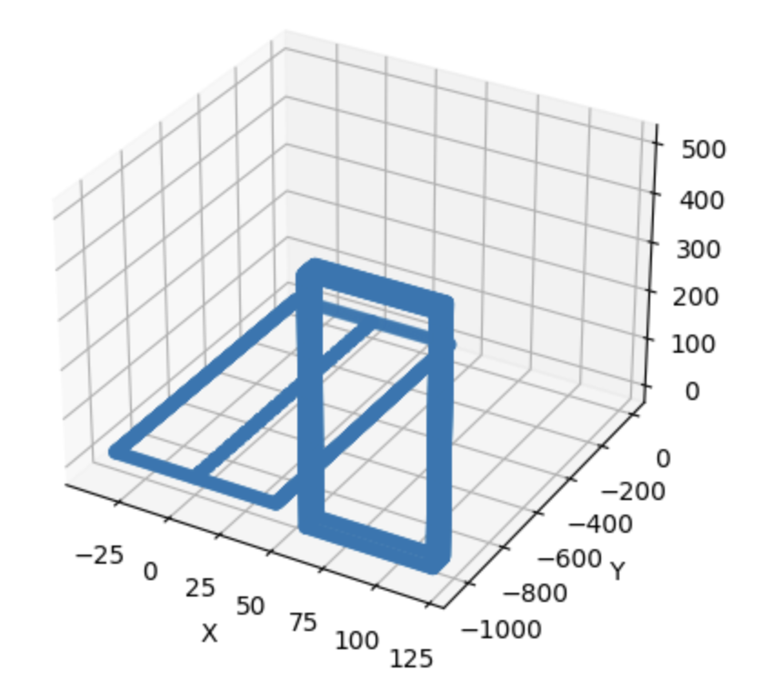
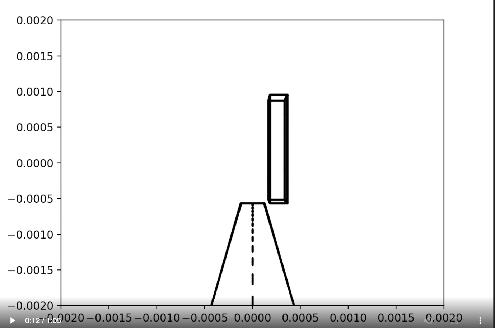
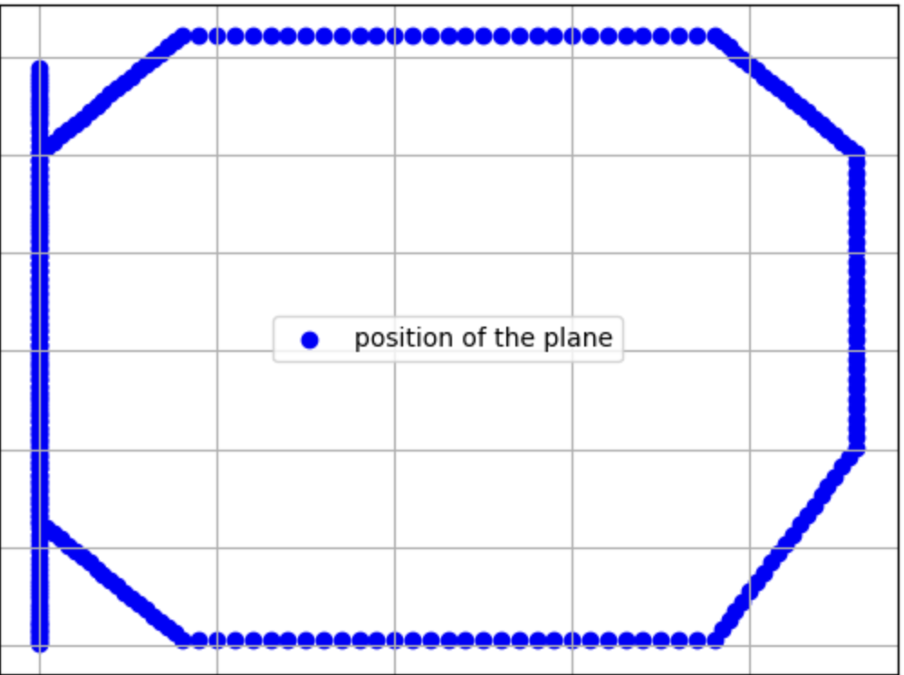

**Question 1: Airplane simulation**

Given 3d points representing an airport runway and control tower, our
task was to simulate the travel of an airplane as its navigates over the
airport.

Figure 1The datapoints provided representing the runway and control
tower

The animation is created by manipulating 3D points representing the
airplane\'s position and orientation using rotation matrices, projection
matrices, and matplotlib\'s animation module.

The animation consists of several stages that simulate the different
phases of an airplane\'s flight, including takeoff, ascent, turns,
descent, and landing.

The animation starts with the airplane accelerating on the runway, then
ascending at an angle, tilting down to its neutral position, and making
several right turns. Finally, the animation simulates the landing of the
airplane, including adjusting altitude and position.

This is created using a series of if-else statements that define the
position and orientation of the airplane at each frame of the animation.
The global variables tx, ty, tz, beta, alpha, and gamma are used to
store the current position and orientation of the airplane, which are
updated at each frame based on the defined stages of the animation.

Figure 2The starting position

Figure 3The plane at some altitude

The rotation matrices bet, alp, and gam are used to apply rotations to
the 3D points representing the airplane\'s position. These matrices are
multiplied together to obtain the final rotation matrix rotation_matrix,
which is then used to rotate the 3D points. The projection matrix focus
is used to apply perspective projection to the rotated 3D points, and
the resulting 2D points are plotted using matplotlib\'s plot() function.

The animation is displayed using matplotlib\'s animation module, which
allows for the creation of animated plots. The animation_takeoff
function is defined as the update function for the animation, which gets
called at each frame to update the plot with the new position and
orientation of the airplane.

The final flight of the plane charts an almost oval shape if viewed from
above.

Figure 4Overall flight of the plane

References:

<https://stackoverflow.com/questions/724219/how-to-convert-a-3d-point-into-2d-perspective-projection>

<http://ksimek.github.io/2012/08/13/introduction/> - The Perspective Camera - An Interactive Tour

All coding work done by Aravind Dendukuri

Report written by Aravind Dendukuri

Project discussed with Rasika Muralidharan and Ganesh Arkanath
